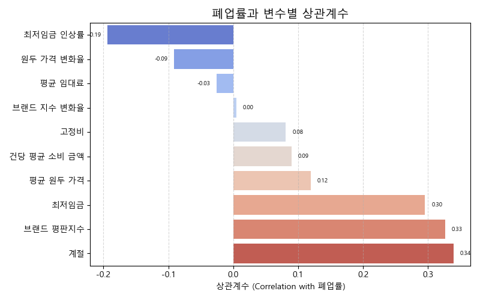
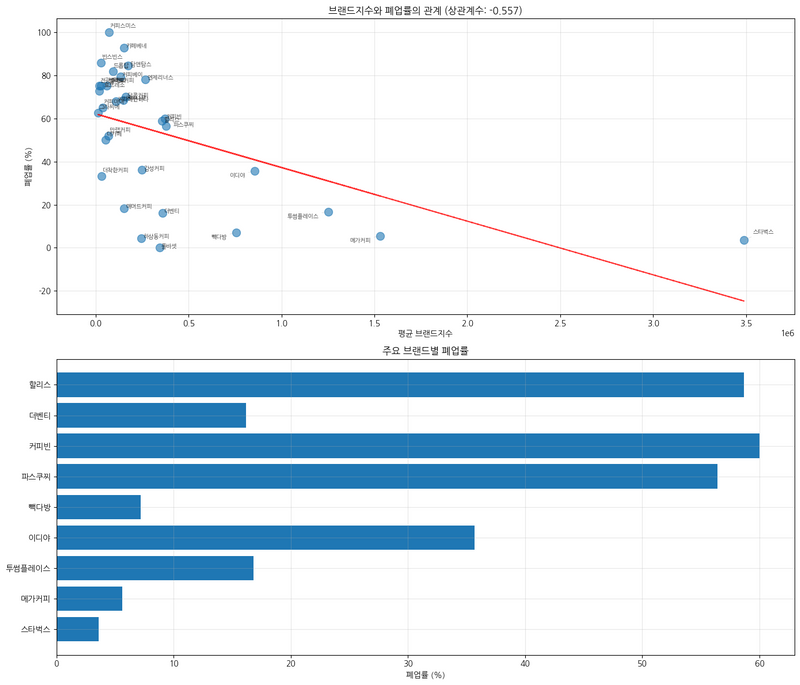
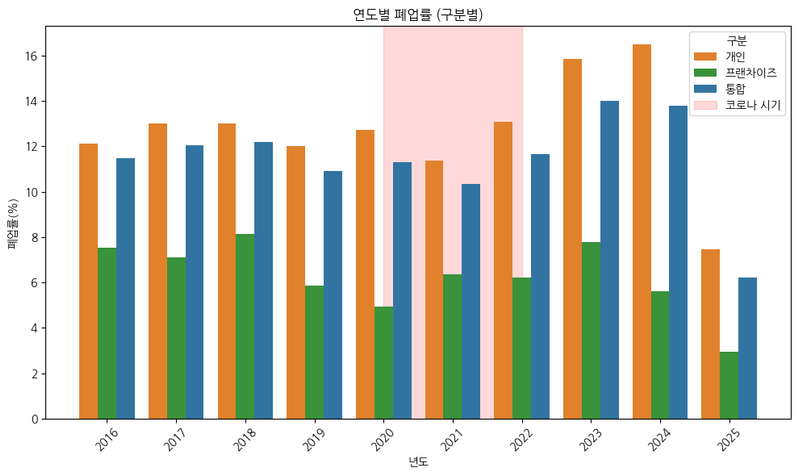
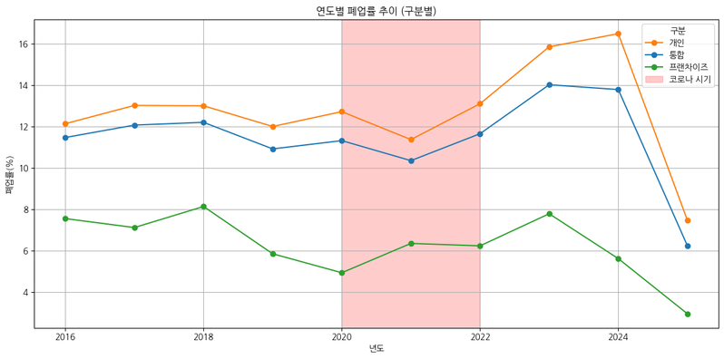
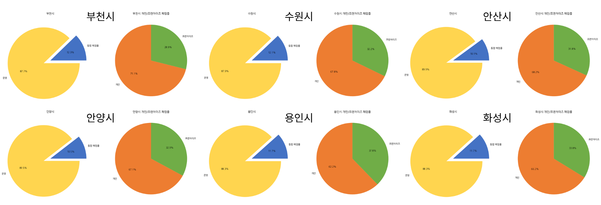
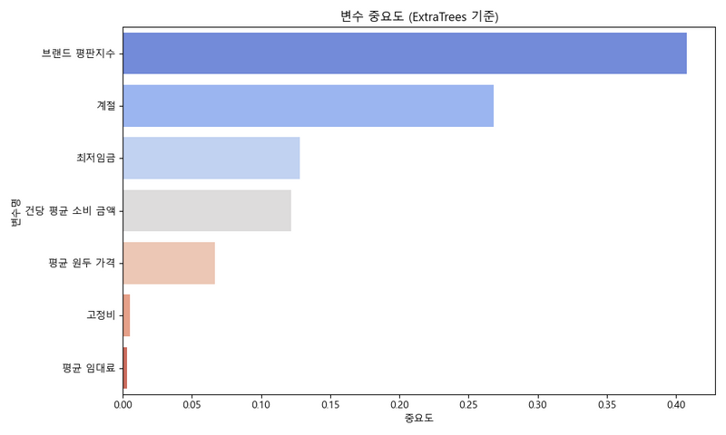
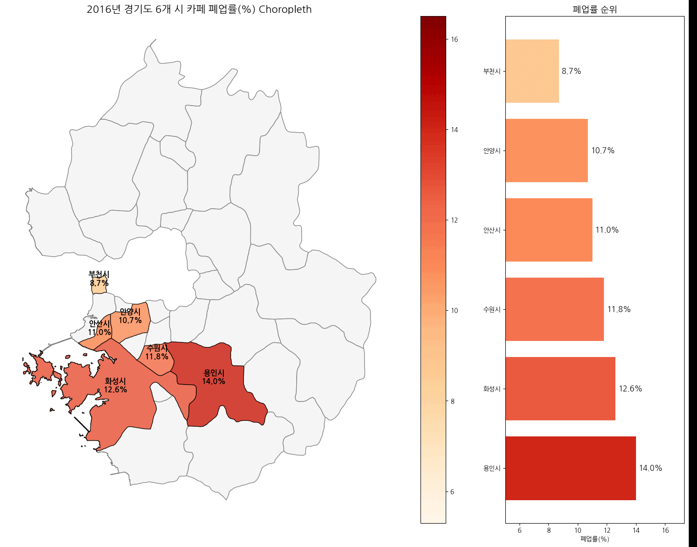

# SK 네트웍스 Family AI 캠프 16기 2차 프로젝트
## ☕ 카페 폐업률 분석 및 예측 AI 모델

<div align="center">


[](https://github.com/SKNETWORKS-FAMILY-AICAMP/SKN16-2nd-4Team/graphs/contributors)
[](https://github.com/SKNETWORKS-FAMILY-AICAMP/SKN16-2nd-4Team/commits/main)
[](README.md)

## 👥 팀 소개
### 커피 4조

|  |  |  |  |
| :---------------------------------------------------------------------------------: | :---------------------------------------------------------------------------------: | :---------------------------------------------------------------------------------: | :---------------------------------------------------------------------------------: |
|                                    **👑 문승현**                                     |                                     **이현민**                                      |                                     **한혜경**                                      |                                     **황하영**                                      |
|                                  총괄 관리, 모델링                                  |                                   전처리, 모델링                                    |                                   전처리, 시각화                                    |                               데이터 수집, 화면 구성                                |


# 📅 WBS (Work Breakdown Structure)  

## 📅 프로젝트 타임라인

### 📊 단계별 주요 작업
1. **데이터 수집 및 전처리** (8/5 오전)
   - 카페 운영 데이터 정제
   - 외부 데이터 연동 및 통합
   - 결측치, 이상치 처리

2. **EDA 및 시각화** (8/5 오후)
   - 상관관계 분석
   - 변수별 분포 확인
   - 시각화 자료 작성

3. **모델링 및 평가** (8/6 오전)
   - 모델 설계 및 구현
   - 하이퍼파라미터 튜닝
   - 성능 평가 및 개선

4. **결과 분석** (8/6 오후)
   - 최종 모델 선정
   - 인사이트 도출
   - 발표 자료 작성

### 🤖 팀원 역할 매트릭스
| 업무 영역     | 문승현 | 이현민 | 한혜경 | 황하영 |
| ------------- | ------ | ------ | ------ | ------ |
| 프로젝트 관리 | ✅ 주도 | 🔄 지원 | 🔄 지원 | 🔄 지원 |
| 데이터 수집   | ✅ 주도 | ✅ 주도 | ✅ 주도 | ✅ 주도 |
| 전처리 & EDA  | ✅ 주도 | ✅ 주도 | ✅ 주도 | 🔄 지원 |
| 모델링        | ✅ 주도 | ✅ 주도 | 🔄 지원 | 🔄 지원 |
| 시각화        | 🔄 지원 | 🔄 지원 | ✅ 주도 | ✅ 주도 |

</div>

## 📋 목차
1. [프로젝트 개요](#-프로젝트-개요)
2. [배경 및 문제 정의](#-배경-및-문제-정의)
3. [데이터 수집](#-데이터-수집)
4. [데이터 전처리 및 통계적 검증](#-데이터-전처리-및-통계적-검증)
5. [모델링](#-모델링)
6. [모델 평가](#-모델-평가)
7. [결과 및 분석](#-결과-및-분석)
8. [프로젝트 산출물](#-프로젝트-산출물)
9. [프로젝트 한계점 및 향후 계획](#-프로젝트-한계점-및-향후-계획)
10. [프로젝트 회고](#-프로젝트-회고)


## 🚀 Quick Start

```bash
git clone https://github.com/SKNETWORKS-FAMILY-AICAMP/SKN16-2nd-4Team.git

cd SKN16-2nd-4Team

pip install -r requirements.txt

python src/models/merge_n_learning.py
```

## 💫 프로젝트 개요
- **프로젝트명**: 경기도 카페 폐업률 예측 AI 모델 개발
- **분석 대상**: 경기도 6개 시 카페 15,959건 (2016-2025)
- **개발 기간**: 2025.08.05 ~ 2025.08.06 (2일)
- **핵심 성과**: 앙상블 모델 예측 정확도 **R² 0.894**, **RMSE 0.046** 달성
- **주요 발견**: 브랜드 평판지수, 계절, 최저임금이 폐업률에 가장 큰 영향을 미치는 주요 변수로 확인

### 🎯 프로젝트 핵심 결과 미리보기

*주요 변수들과 폐업률 간의 상관계수*

## 🎯 배경 및 문제 정의

### 📊 배경
- **시장 현황**: 전국 커피전문점 수 10만개 이상의 "커피공화국"
- **문제점**: 높은 카페 창업률 대비 폐업률 증가 (부천 12.3%, 수원 12.1% 등)
- **경제적 영향**: 최저임금 인상, 임대료 상승, 원두 가격 상승으로 인한 운영비 부담으로 추정

### 🎯 가설 정의
**"과연 어떤 요인들이 
폐업률에 유의미한 영향을 미치는가?"**
> 고정비(원두 가격, 임대료, 인건비), 계절 등 요소가
 폐업률에 유의미한 영향을 미친다.

### 📈 해결 목표
1. 카페 폐업에 영향을 미치는 주요 요인 규명
2. 지역별, 시기별 폐업률 패턴 분석
3. 머신러닝 기반 폐업률 예측 모델 개발

## 📊 데이터 수집

### 🗂️ 수집 데이터 현황
| 데이터 유형          | 출처                       | 건수/기간     | 형태 |
| -------------------- | -------------------------- | ------------- | ---- |
| **카페 운영 데이터** | 행정안전부 지방행정 인허가 | 15,959건      | CSV  |
| **카드 소비 데이터** | 경기데이터드림             | 2016-2024     | CSV  |
| **최저임금 데이터**  | 국가통계포탈               | 2016-2025     | CSV  |
| **임대료 데이터**    | 부동산통계처 토지통계부    | 2016-2024     | CSV  |
| **커피 원두 가격**   | 식품산업통계정보           | 2020-2024     | CSV  |
| **브랜드 평판지수**  | 한국기업평판연구소         | 월별 업데이트 | CSV  |

### 📍 분석 지역
- **대상 지역**: 경기도 6개 시 (부천, 수원, 안산, 안양, 용인, 화성)
- **선정 기준**: 카페 밀집도, 인구 규모, 경제활동 수준 고려
  
## 🧹 데이터 전처리 및 통계적 검증

### 📋 전처리 프로세스
1. **결측치 처리**
   - 경제지표: 선형 보간법 적용
   - 브랜드 데이터: 평균값으로 대체

2. **이상치 탐지 및 처리**
   - IQR 방식 적용으로 극값 제거
   - 운영기간 음수 값 제거

3. **피처 엔지니어링**
   - 운영기간 계산 (일 단위)
   - 계절성 변수 생성 (Q1-Q4)
   - 경제지표 증감률 계산
   - 브랜드 평판지수 정규화

### 🧪 통계적 검증
#### 상관관계 분석 결과
- **브랜드 평판지수 ↔ 폐업률**: 강한 음의 상관관계 (브랜드 가치가 높을수록 폐업률 감소)
- 
- **최저임금 ↔ 폐업률**: 양의 상관관계 (인건비 부담이 폐업률에 영향)
- **계절 ↔ 폐업률**: 시기별 폐업률 패턴 존재 (4분기 폐업률 상승 경향)

### 📈 전처리 결과 시각화




### 📊 추가 분석 결과
현재 프로젝트에서는 **9개의 핵심 시각화**를 통해 분석 결과를 제시하며, 다음과 같은 추가 분석 자료들이 준비되어 있습니다:
- **상관관계 분석**: `assets/visualization/correlation`
- **모델 성능 분석**: `assets/visualization/model`  
- **시계열 분석**: `assets/visualization/time_series`
- **패턴 분석**: `assets/visualization/patterns`

## 🤖 모델링

### 🏗️ 모델 설계
**문제 유형**: 회귀 분석 (Regression)  
**타겟 변수**: 카페 폐업률 (연속형 변수)  
**평가 지표**: R², RMSE, MAE

### 🤖 모델링 진행

#### 1️⃣ 단일 모델 성능
| 모델              | R² Score | RMSE   | MAE    | 특징                                          |
| ----------------- | -------- | ------ | ------ | --------------------------------------------- |
| **LightGBM**      | 0.9539   | 0.0306 | 0.0175 | 고성능 + 튜닝으로 성능 극대화 (Boosting 계열) |
| **ExtraTrees**    | 0.6711   | 0.0816 | 0.0635 | 매우 무작위적 + 빠르고 안정적 (Bagging 계열)  |
| **Random Forest** | 0.8691   | 0.0515 | 0.0359 | 밸런스가 좋은 클래식 모델 (Bagging 계열)      |

#### 2️⃣ 앙상블 모델 (최종 선택)
- **모델 구성**: VotingRegressor (LightGBM + ExtraTrees + Random Forest)
- **과적합 방지**: L1, L2 규제 추가
- **성능**: **R² 0.8935**, **RMSE 0.0464**, **MAE 0.0351**

## 📊 모델 평가

### 📈 성능 평가 지표

#### 🎯 정확도 지표
- **R² Score**: **0.894** (0.894 달성 ✅)
- **RMSE**: **0.0464** (낮을수록 좋음)
- **MAE**: **0.0351** (평균 절대 오차)

#### 📊 교차 검증 결과
- **일반화 성능**: 과적합 없이 안정적 성능 유지

### 🔍 변수 중요도 분석


#### 주요 변수 기여도
1. **브랜드 평판지수** - 가장 높은 중요도
2. **계절성** - 시기별 영향
3. **최저임금** - 인건비 부담
4. **소비액** - 소비 패턴
5. **원두가격** - 고정비 부담

**주요 발견사항**:
- 브랜드 평판지수 증가 → 폐업률 감소
- 최저임금 인상 → 폐업률 증가
- Q4(4분기) → 폐업률 상승 경향

## 🎯 결과 및 분석

### 💡 모델링에 의한 문제 분석 및 방안 추론

#### 🔍 주요 발견사항
1. **브랜드 가치의 결정적 역할**
   - 브랜드 평판지수가 폐업률에 **가장 큰 영향**
   - 브랜드 평판 향상 시 폐업률 **유의미한 감소** 효과

2. **경제적 부담의 직접적 영향**
   - 최저임금 상승이 폐업률 **증가에 기여**
   - 임대료보다 **인건비 부담이 더 큰 영향**

3. **지역별 위험도 차등화**
   - 부천(12.3%) > 수원(12.1%) > 용인, 화성(11.7%) > 안양(10.5) > 안산(10.1) 순
   - 지역별 **맞춤형 지원 정책** 필요성 확인
   

4. **계절성 패턴 발견**
   - 4분기(Q4) 폐업률 상승 경향
   - **연말 정산 및 임대료 재계약** 시기와 연관

### 📊 비즈니스 임팩트 및 활용 방안

#### 🎯 창업자 지원 방안
1. **위험도 예측 시스템**
   - 창업 전 폐업 위험도 사전 진단
   - 지역별 추천 입지 제공

2. **브랜드 강화 전략**
   - SNS 마케팅 및 온라인 평판 관리
   - 고객 리뷰 시스템 구축

3. **운영 효율화 지원**
   - 키오스크 도입을 통한 인건비 절감
   - 시간대별 인력 운영 최적화

4. **정책 제언**
   - 소상공인 대상 브랜딩 지원 프로그램
   - 지역별 차등 임대료 지원 정책

## 📂 프로젝트 산출물

- ✅ **인공지능 데이터 전처리**: `data/processed` 폴더 내 정제된 데이터
- ✅ **인공지능 학습 결과서**: `assets/visualization/model`
- ✅ **학습된 인공지능 모델**: `src/models/merge_n_learning.py` - 앙상블 모델
- ✅ **발표자료**: 프로젝트 전 과정 포함한 종합 발표 자료 `assets/4조_발표자료.pdf`

### 📊 옵션 산출물
- ✅ **분석 화면 (Streamlit)**: 폐업률 예측 대시보드 (화면구성도 `assets/screens` 참고)

### 📁 프로젝트 구조
```
SKN16-2nd-4Team/
├── 📂 data/
│   ├── 📂 raw/                    # 원본 데이터
│   └── 📂 processed/              # 전처리된 데이터
├── 📂 notebooks/EDA/              # 데이터 분석 및 전처리 과정
├── 📂 src/models/                 # 학습된 AI 모델
└── 📂 assets/visualization/       # 분석 결과 시각화
```

### 🔗 분석 노트북 (상세 분석 과정)
- **브랜드 분석**: `notebooks/EDA/브랜드지수_.ipynb`
- **카페 폐업률 분석**: `notebooks/EDA/카페데이터_폐업률.ipynb`
- **임대료 영향 분석**: `notebooks/EDA/임대료_비교.ipynb`
- **원두 가격 분석**: `notebooks/EDA/커피_원두값_데이터.ipynb`
- **카페 데이터 전처리**: `notebooks/EDA/일반_휴게_내_카페_데이터.ipynb`

## 🔍 프로젝트 한계점 및 향후 계획

### ⚠️ 현재 한계점
1. **데이터 범위**: 경기도 6개 시 한정 (전국 확대 필요)
2. **분석 기간**: 2일간 단기 프로젝트 (심화 분석 시간 부족)
3. **외부 변수**: 코로나19, 오너리스크 등 예외적 상황 미반영
4. **실시간 데이터**: 정적 데이터 기반 (실시간 업데이트 필요)

### 🚀 향후 발전 계획
1. **지역 확대**: 서울, 부산 등 전국 주요 도시로 분석 범위 확대
2. **실시간 시스템**: API 기반 실시간 폐업률 예측 서비스 구축
3. **딥러닝 도입**: LSTM, Transformer 기반 시계열 예측 모델 적용

### 💼 기대 효과
- **창업 성공률 향상**: 사전 위험도 진단으로 실패 예방
- **정책 수립 지원**: 데이터 기반 소상공인 지원 정책 개발
- **경제적 파급효과**: 카페 업계 안정성 향상 및 일자리 창출


## ✨ 프로젝트 회고

### 👥 개인별 소감 및 성장 포인트
- **문승현 👑**: 돌아보니 미처 생각 못했던 아쉬운 부분도 있었지만 그런 부분들을 통해 더 발전할 부분 또한 찾을 수 있어서 의미있는 프로젝트였다.

- **이현민**: 이번 프로젝트를 통해 데이터의 복잡성을 체감하고 예측의 가치를 경험할 수 있었습니다. 특히 실제 데이터를 수집하는 과정에서 데이터를 수집하고 전처리하는 과정이 모델링보다 어렵고 중요하다는 것을 깨달았습니다. 초기에는 원두 가격이나 임대료 같은 고정비가 폐업의 주원인일 것이라 예상했으나 변수들을 종합적으로 분석하는 과정을 통해 계절 변화와 최저임금 인상률, 브랜드 지수가 더 영향을 미친다는 사실을 발견했습니다. 이처럼 데이터는 막연한 예측이 아닌 데이터를 통해 객관적으로 분석해준다는 점이 가장 흥미로운 부분이었습니다. 초기 모델링 과정에서 과적합 문제가 있었으나 앙상블 모델을 적용하여 안정적인 예측 성능을 얻을 수 있었습니다. 이번 경험으로 머신러닝이 현실의 문제에 적용되며 해결할 수 있음을 확인했으며, 데이터 분석가로서 실질적인 역량을 기를 수 있었습니다.

- **한혜경**: 카페 폐업률 분석을 위한 데이터 정제와 시각화 작업을 맡아 기반을 잘 마련했다고 생각합니다.
하지만 그 부분에 집중하느라 정작 분석에는 충분히 참여하지 못한 점이 아쉬웠습니다.
발표 자료가 방대했으나 준비 시간이 부족해 시간 초과로 당황했고, Q&A 시간도 충분하지 않았습니다.
다음 프로젝트에서는 필요한 작업에 균형 있게 참여하고, 발표 기회가 주어지면 적절히 준비해 시간 내에 마무리하는 것을 목표로 하고 싶습니다.

- **황하영**: 데이터 상태에 따라 많은 것이 좌지우지 될 수 있다는 것을 느꼈고, 데이터 전처리나 모델링에 대해 더 공부해야 할 필요성을 느꼈다. 무엇보다도 스스로의 부족함을 여실히 느낄 수 있었던 프로젝트였다. 열심히 참여해준 팀원들에게 미안하고 고맙다.